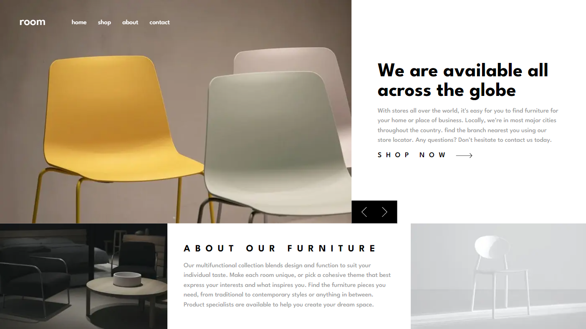
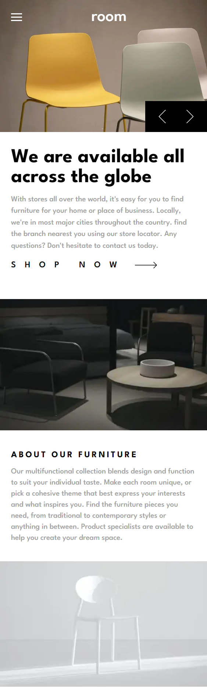

# Frontend Mentor - Room homepage solution

This is a solution to the [Room homepage challenge on Frontend Mentor](https://www.frontendmentor.io/challenges/room-homepage-BtdBY_ENq). Frontend Mentor challenges help you improve your coding skills by building realistic projects.

## Table of contents

- [Overview](#overview)
  - [Screenshot](#screenshot)
  - [Links](#links)
  - [Built with](#built-with)
- [Author](#author)

## Overview

This is a basic two section hoompage

### The challenge

Users should be able to:

- View the optimal layout for the site depending on their device's screen size
- Navigate the slider using mouse

### Screenshot

### Links

- Solution URL: [github repo](https://github.com/Ashraful-Mijan/room-homepage)
- Live Site URL: [live site](https://room-homepage-xi-ten.vercel.app/)

### Built with

- Semantic HTML5 markup
- CSS Flexbox
- CSS Grid
- Mobile-first workflow
- [React](https://reactjs.org/) - JS library
- [Next.js](https://nextjs.org/) - React framework
- [tailwindCSS](https://tailwindcss.com/) - CSS framework

## Author

- Website - [Ashraful Mijan](https://ashrafulmijan.com/)
- Frontend Mentor - [@Ashraful-Mijan](https://www.frontendmentor.io/profile/Ashraful-Mijan)
